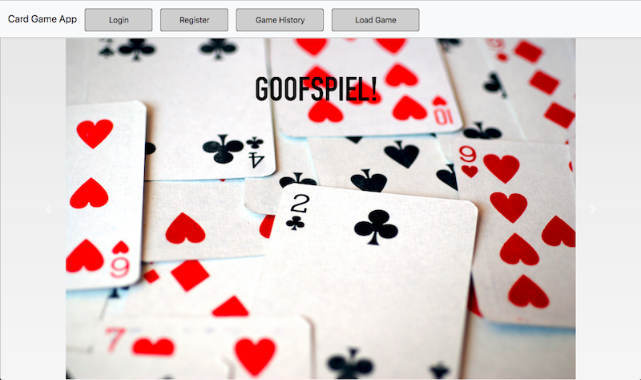
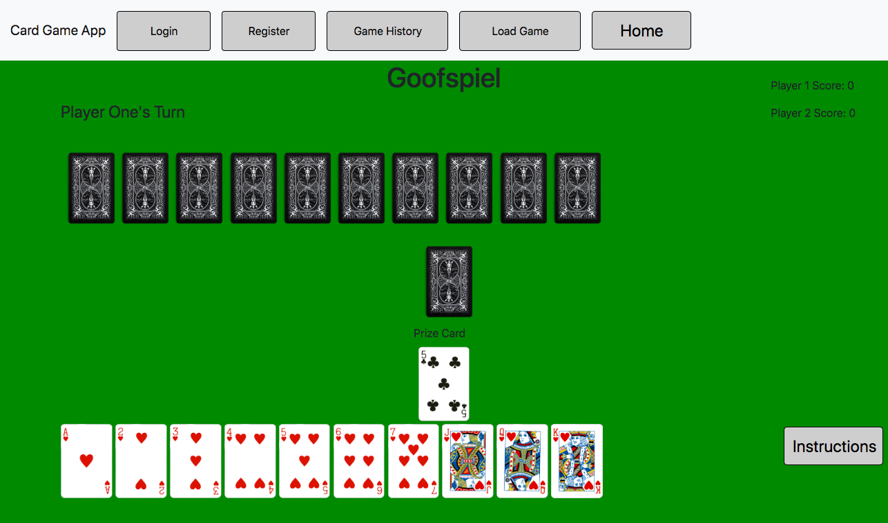

## Card Game App
* lighthouse labs project mid-term project
created by Alex and Taylor
### Purpose
* the purpose of this project was to create a card game web application with the card game Goofspiel and others for users to play.
### functionality
* allows for users to navigate through pages
* play a two player version of Goofspiel on the same computer
* generates a gameboard with interactive cards, a scoreboard, and player prompts
* modals used for login, registration, game instructions, game history and to load saved games.
 * use of cookie sessions

### design
* sass was used for the design of each individual page, allowing for modularity of design
* bootstrap 4 implimented to allow for easier rendering of page design
### final product

### Dependencies
* Node.js
* Express
* EJS
* Compression
* Knex
* cookie-session
* Morgan
* Path
* PostgresQL
* Prompt
* Sass
### Getting started
* install all dependencies (using npm -i command)
* run the development web server using npm start command.